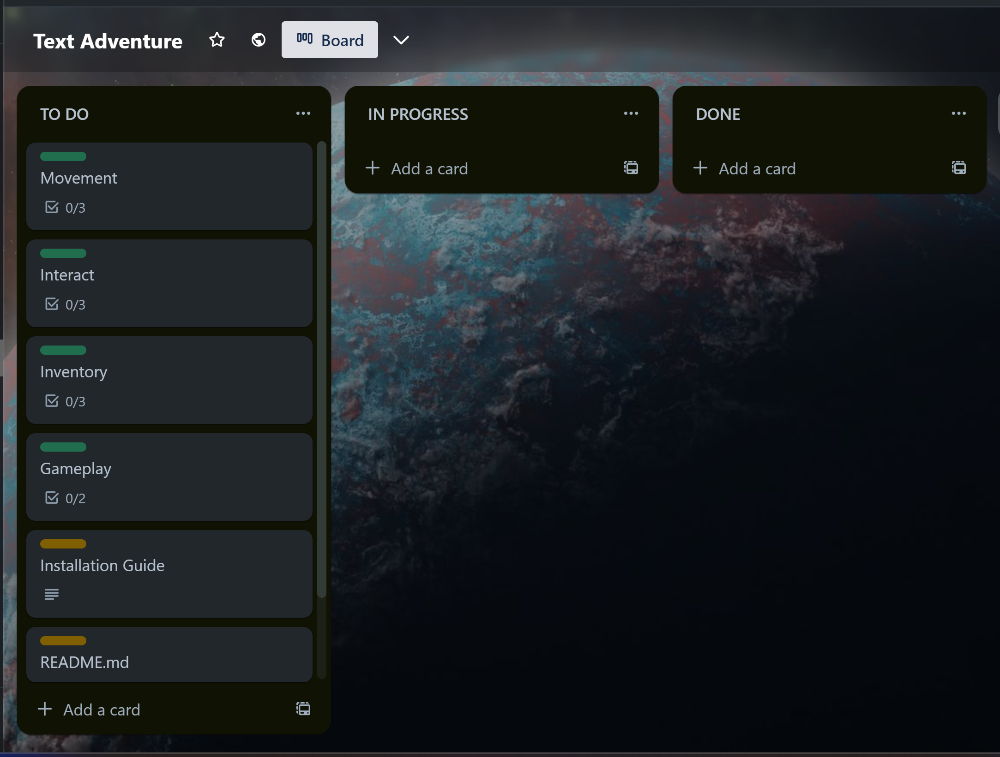
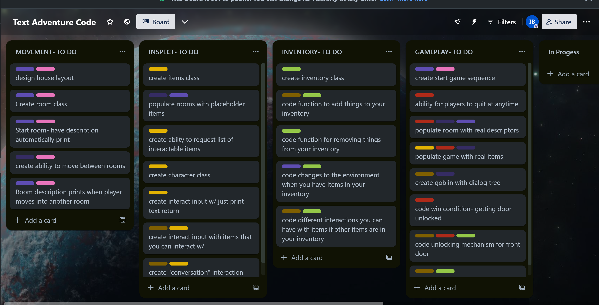
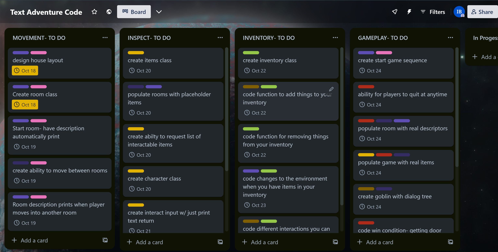
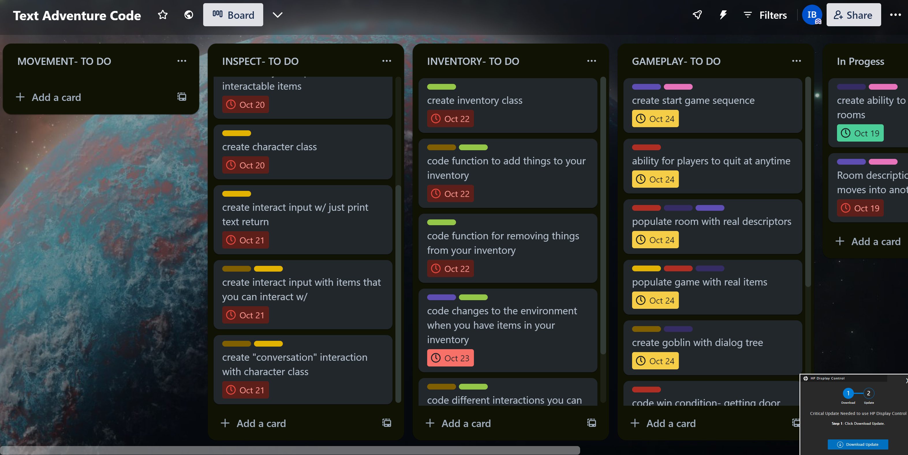
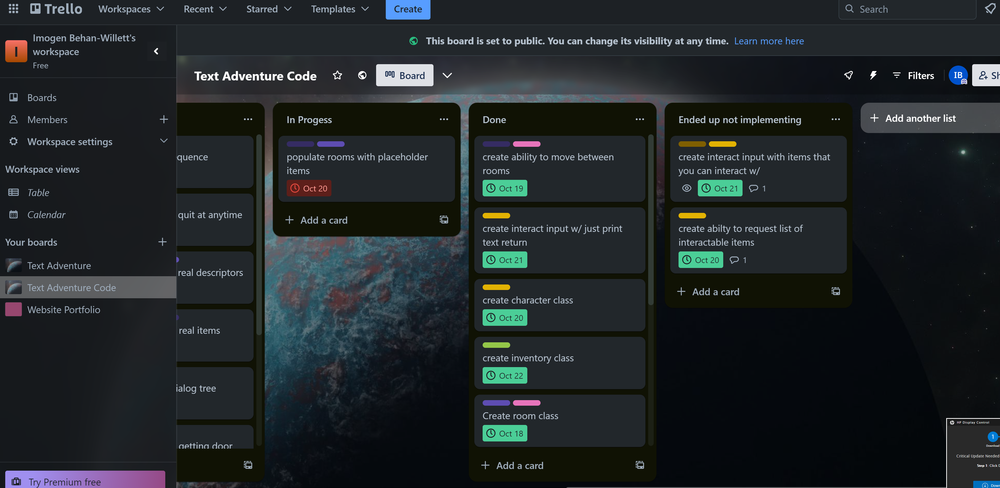
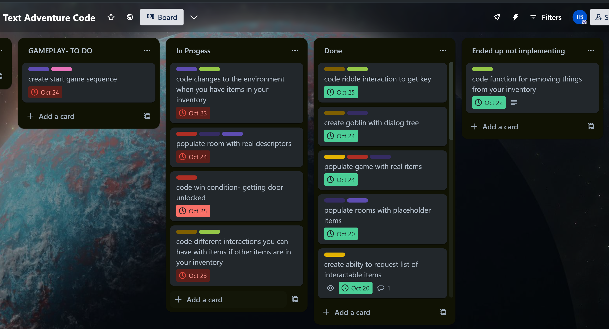
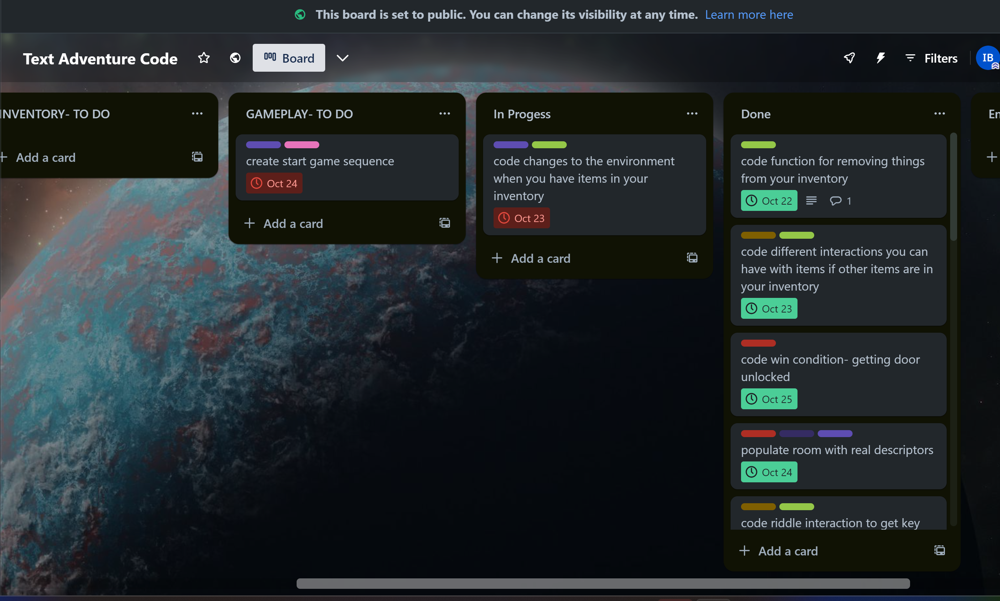
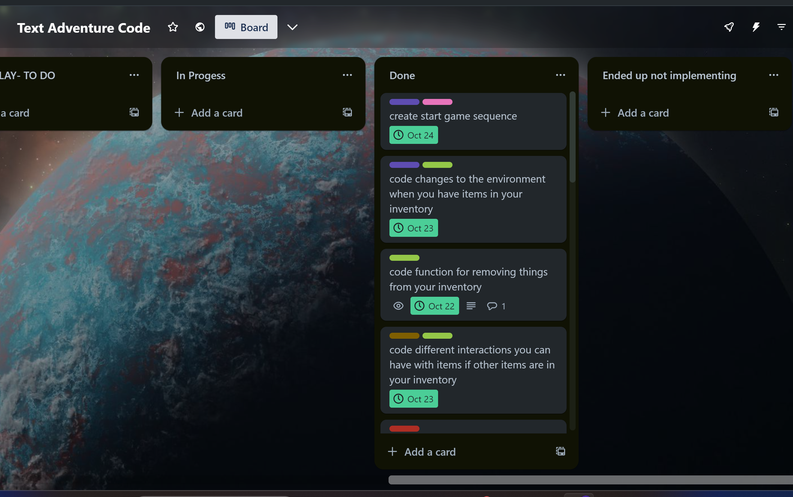

# Source Control Repository
[Link to GitHub](https://github.com/ibehanwillett/Coder-Acad/tree/main/terminal-app)
# Code Style Guide
This code was styled according to [the PEP 8 Style Guide.](https://peps.python.org/pep-0008/)
# Features
This terminal application is a text adventure about a haunted house. It's three main features are movement, inpect/interact and inventory.
## 1. Movement
This is the feature that enables the player to explore the haunted house. 
Movement breaks down into three agile user stories with accompanying acceptance criteria.
### Rooms
As the player, when I start the game or move rooms I would like a description of my current whereabouts so that I can know where I am.
#### Acceptance Criteria:
Given that the terminal application is running, upon start up or moving rooms a description of a the room and exits should print.
### Doors
As the player, I want to know my options on where I can go in game so that I can pick where I want to move to next.
#### Acceptance Criteria:
Given that the room descriptor has printed with the potential exits, then the user should be able to input the exit they'd like to take.
### Populate
As the player, I want the rooms in the house to have different descriptions, items to interact with and charaters populate it so that the game has content for me to consume.
#### Acceptance Criteria:
Given that the terminal application is running, when the description of the room is printed out, then that room should have a unique description, items and the possibility of charaters populating it.
## 2. Inspect / Interact
This feature is the primary way that users can interact with the game. It enables players to interact with elements within the game, whether that is inspecting an item or interacting with a charater.
Inspect/ interact breaks down into three agile user stories with accompanying acceptance criteria.
### Inspect
As the player, I want to have a prompt of what I can interact / inspect in the room so that I know what is interactable and what is just flavourtext.

#### Acceptance Criteria:
Given that the the room descriptor has printed, when asked for their input then the user should be able to request a list of interactable items.
### Interact
As a player, I want to be able to interact with some of these items, such as turning a page or blowing out a candle, so that I feel I can effect the game.
#### Acceptance Criteria:
Given that the player can know which items in the room are interactable, when they are next asked for their input, the player should be able to select which items to interact with.
### Speak
As a player, I want to be able to speak with some of the characters so I can gain items from them.
#### Acceptance Criteria:
Given that each room has a unique description, set of items, and can include charaters when the room does have a character in it, the player should be able to speak to this charater.
## 3. Inventory
This feature eneables the player to pick items up and store them in their inventory.
It breaks down into three agile user stories with accompanying acceptance criteria.
Inventory breaks down into three agile user stories with accompanying acceptance criteria.
### Inventory
As the player, I would like to be able to pick up items in the game so that I can use them later on. 
#### Acceptance Criteria:
Given that a item can be inspected, certain items should be able to be added to inventory after being inspected by the user.
### Implict Use
As a player, I would like items in my inventory to change the game without my explict input, so that the game feels more dynamic and interesting.
#### Acceptance Criteria:
Given that an item is in the player's inventory, when the player enters a room the description should change without needing a player's input
### Explict Use
As the player, I would like to explictedly use items to change the game so that I feel like I have control over the world. 
#### Acceptance Criteria:
Given that an item is in the player's inventory, when the player is interacting with an object they should get a prompt to use the item in conjunction with the inspected item.
# Implementation Plan
## [My Trello Kanban Board](https://trello.com/b/NjQMq9lQ/text-adventure).

In the event that the board is not accessible, please find the following screenshots. 
In some of the screenshots, the due date that was set for the task is not visible. For these dates, please refer to the above hyperlink to the Trello board.
### Overall Plan

### Intial Plan

Please note- Some of the tasks for the inspect feature can't be seen in this screenshot. Please see the above hyperlink to the Trello board for these tasks. 
### Progress as of the 18th of October 2023

### Progress as of the 24th of October 2023

After a unfortunately period of sickness, I was behind on my implementation plan.
### Progress as of the 25th of October 2023

At some points of development, not implementing some aspects of features was considered. These aspects were eventually all implemented.
### Progress as of the 26th of October 2023

### Progress as of the 27th of October 2023

### Progress as of the 29th of October 2023



# Installation Guide
## 1. Locate the Bash Script
Locate the bash script, it will be in the same directory as the ReADME.md you are currently reading. 
The script's permissions are already set to be executable by default. In the case there is an error regarding permissions, please run the following command:
```bash
chmod +x play_game.sh
```
## 2. Run the script
Input the following into the command line.
```bash
./play_game.sh
```
The script will then automatically create a virtual enviroment and install the required dependencies.
A list of these dependencies can be found at the bottom of this documentation.
# System & Hardwear Requirements
## Python
This text adventure require Python 3.10 to be installed. 
To check what version of Python you have installed on you computer,  run the following command:
```bash
python --version
```
If you have an older version of Python or do not have Python installed, please follow [this Python installation guide.](https://wiki.python.org/moin/BeginnersGuide/Download)

## Dependencies
* colorama==0.4.6
* evdev==1.6.1
* exceptiongroup==1.1.3
* iniconfig==2.0.0
* packaging==23.2
* pluggy==1.3.0
* pytest==7.4.3
* python-xlib==0.33
* six==1.16.0
* termcolor==2.3.0
* tomli==2.0.1

## References
